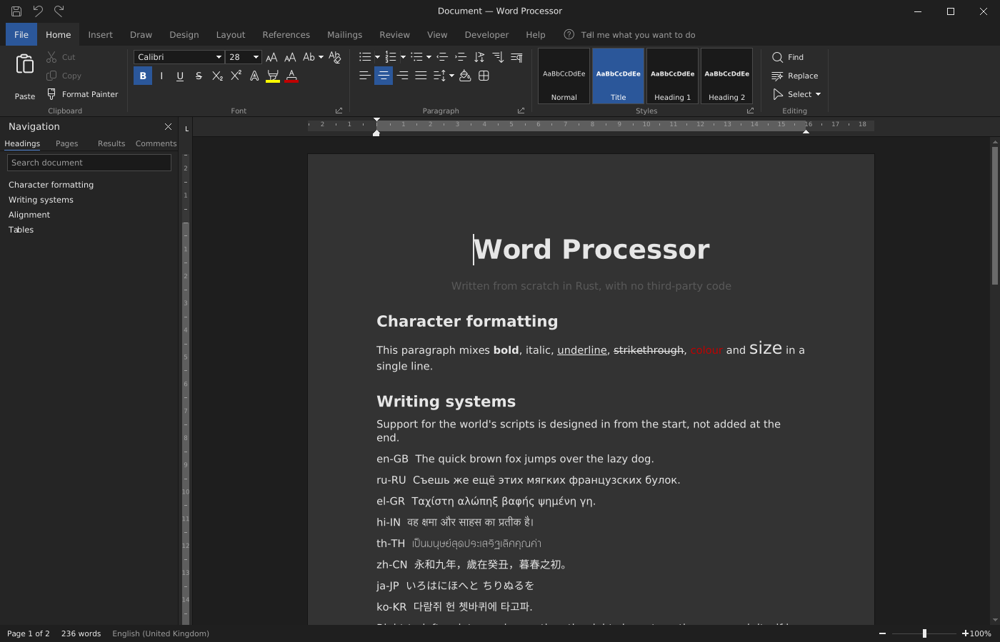
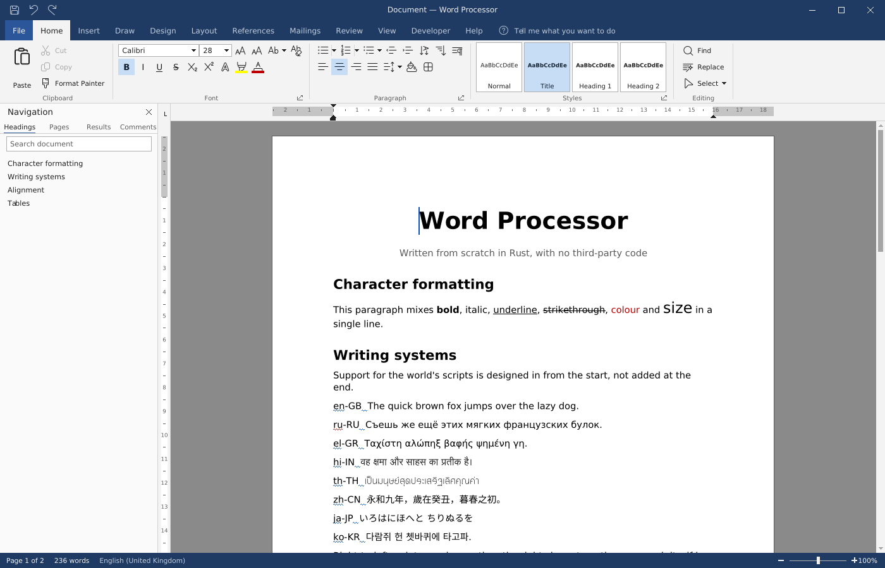
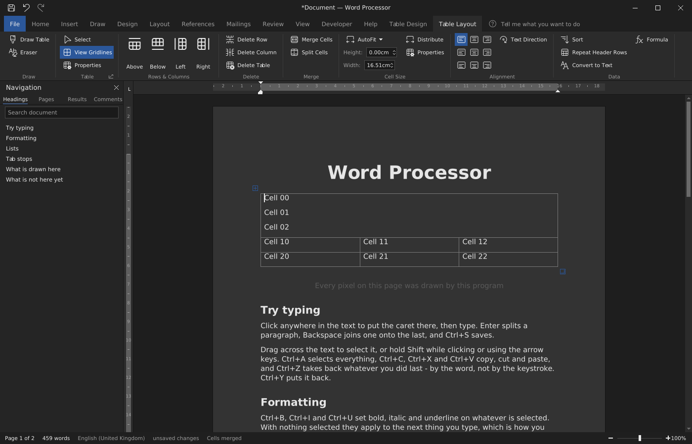
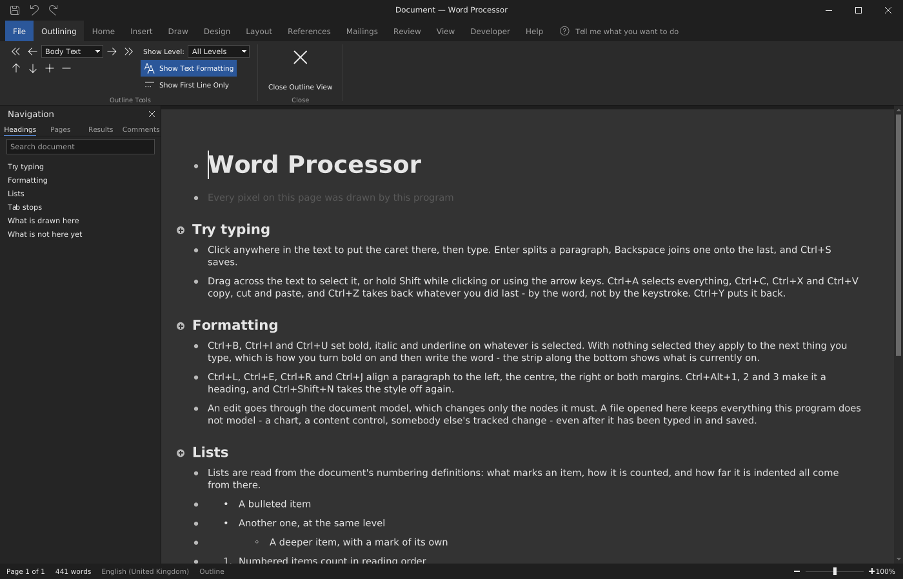
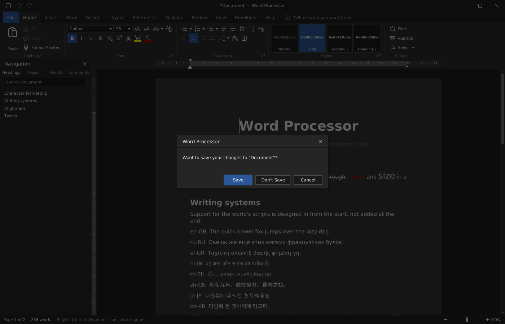

# Word Processor

An open-source word processor that reads and writes the same file formats as
Microsoft Word and aims for the same feature set.

**Status: it is a word processor.** A `.docx` opens in a window with a ribbon,
and Microsoft Word opens back everything this program writes. The archive is
unpacked, the XML parsed, the styles resolved, the fonts read from the machine
and shaped, the glyph outlines rasterized, the pages laid out and every pixel of
the window drawn by code in this repository.

What the document model holds is most of what the format can carry: sections
with their own paper, margins, columns and headers; styles, lists, tables and
tab stops; pictures, shapes, charts, equations, diagrams and ink; footnotes,
captions, cross-references, a table of contents, citations and an index;
comments, tracked changes, a document comparison and a mail merge.

What the window does is what Word's window does. The ribbon and its tabs, the
rulers, the navigation pane, the status strip, find and replace, the mini
toolbar over a selection, the menu the right button opens, the tooltips, and the
letters Alt puts over the ribbon. The mouse behaves the same way too: a double
click takes a word and a third takes the paragraph, the margin selects lines,
text can be carried somewhere else, Ctrl and the wheel zooms, and the middle
button starts the scroll that follows the pointer.

Printing goes to a real printer through the same layout that draws the screen.

Deliberate gaps, named rather than hidden: there is no grammar checker, the
Indic scripts are drawn without the reordering they need, and several features
are modelled to the depth a document needs rather than the depth Word's dialogs
offer. Each such limit is stated in the module that owns it. See
[docs/ROADMAP.md](docs/ROADMAP.md) for the plan and the current position.

`word-processor --picture <document.docx|-> <image.png> [width height]` draws the
whole window into a PNG instead of onto a screen, which is how the interface is
checked on a machine with no display.

## What it looks like

Every picture below was drawn by the program itself, with `--picture`, and no
pixel of them comes from anywhere else.

The window, in the dark theme and in the light one, with the sample document:





A table whose top row has just been merged, with the Table Layout tab up:



The outline view, with its Outlining tab and a mark beside every paragraph:



The question asked on closing a document with changes, drawn by the program and
not by the system:



## Principles

These constraints are deliberate and shape every decision in the codebase.

**Written from scratch, in Rust, with zero third-party crates.** Nothing but the
Rust standard library. Compression, ZIP, XML, the package layer and the document
model are all implemented here, and so are the fonts, text shaping, layout,
rasterization and the interface. The only external code the binary touches is
the operating system's own ABI: Win32 on Windows, declared directly with
`extern "system"` rather than through a binding crate, and on Linux the X11
and Wayland wire protocols spoken over their own sockets, with no Xlib and no
`libwayland` — six calls against the C library for passing a file descriptor
and sharing a block of memory, which have no equivalent in the standard
library — and CUPS spoken to in IPP over its socket, with no `libcups`.

**Windows first, Linux supported.** The core carries no operating-system
dependency at all — it turns a document into a pixel buffer with nothing but
`std`. Platform shells are thin, so a third platform is a matter of writing one
more shell.

**Everything builds in Docker.** Nothing is installed on the developer's machine.
One container holds the pinned Rust toolchain and the mingw-w64 linker used to
cross-compile the Windows executable.

**Files survive a round trip.** Word documents contain more than any single
program models — a macro project, an embedded font, a chart, a content control,
somebody else's tracked changes. An opened document is held as an element tree
that keeps all of it, and an edit rewrites only the nodes it must. A document
opened and saved untouched comes back byte for byte identical; one that is
edited differs only where it was edited. This is tested, not merely intended.

**Nothing runs until somebody says so.** A document can carry a program —
Visual Basic — and every mass outbreak of document-borne malware for thirty
years has come through that door. Word's answer is a bar across the top of the
document, a trust centre, trusted locations and signed projects: a macro runs
when the person opening the file says it may, and not before. That is the
behaviour being copied here, in that order. The language runs — the project
read out of the file, every module of it, classes and forms included, with a
debugger that stops on a line — against an object model that answers what it
can and refuses the rest by name; and nothing runs until the gate says so:
not the Run button, not F5, not a document's own `AutoOpen`. A project is
kept untouched through an edit and a save, and edited where its editor was
used. There is also a recorder: the buttons pressed and the words typed,
played back.

**Multilingual from the ground up.** Not a translation added at the end. The text
engine lays out bidirectional scripts and shapes the ones that need shaping:
Arabic and Syriac join, and ligatures are taken wherever a font offers them. The
Indic scripts need reordering within a syllable as well and are not shaped yet.
This has to be designed in from the start; it cannot be retrofitted.

## Trying it

Requires only Docker.

```powershell
.\x.ps1 image      # build the container image (once)
.\x.ps1 test       # run the test suite
.\x.ps1 check      # clippy, warnings treated as errors
.\x.ps1 win        # release build of the Windows .exe -> .\dist\wp.exe
.\x.ps1 linux      # release build for Linux -> ./dist
```

On a Linux or macOS host use `./x.sh` with the same commands.

The windowed application:

```powershell
.\dist\word-processor.exe                 # open with a sample document
.\dist\word-processor.exe mine.docx       # open a file
.\dist\word-processor-setup.exe           # install it, so that documents open in it
```

The installer puts the program where Windows keeps programs a person installs
for themselves, `%LOCALAPPDATA%\Programs\Word Processor`, and needs no
administrator. It registers the Word documents and templates — double-clicking
a template makes a new document from it, as Word's does — adds the program to
the Start menu, and puts it in Settings ▸ Apps, where Uninstall takes it all
off again. On Linux `./dist/word-processor-setup` does the same in
`~/.local/share/word-processor`, with a desktop entry.

Click in the text to put the caret there, then type. The ribbon along the top is
where the commands are; Alt puts a letter over each of its tabs and lets it be
worked from the keyboard alone. Enter splits a paragraph, Backspace joins one
onto the last, Ctrl+S saves. The wheel scrolls, Ctrl and the wheel zooms, and
right-clicking opens a menu about whatever is under the pointer.

`wp` is a command line front end for everything the window does not expose yet:

```powershell
.\dist\wp.exe new demo.docx          # write a document showing what the model covers
.\dist\wp.exe info demo.docx         # list the parts, content types and relationships
.\dist\wp.exe text demo.docx         # print the text
.\dist\wp.exe outline demo.docx      # print the structure with formatting
.\dist\wp.exe roundtrip a.docx b.docx        # open and save, checking nothing changed
.\dist\wp.exe replace a.docx b.docx old new  # replace text, across run boundaries
.\dist\wp.exe append a.docx b.docx "a line"  # add a paragraph at the end
.\dist\wp.exe render a.docx page 150         # draw the pages as PNG images
.\dist\wp.exe fonts                          # list the fonts on this machine
```

The editing commands report which parts of the package changed. Exactly one
should: everything else must come out as it went in.

## Layout

| Crate | Contents |
| --- | --- |
| `wp-deflate` | DEFLATE, zlib, CRC-32, Adler-32 |
| `wp-zip` | ZIP archives, including Zip64 |
| `wp-xml` | XML pull parser and writer, namespace-aware |
| `wp-opc` | Parts, content types, relationships |
| `wp-ole` | The compound file: the file system Office wrapped a document in |
| `wp-hash` | SHA-1, SHA-512 and HMAC, which the passwords and signatures need |
| `wp-cipher` | AES, and the two ways of using it the Office formats ask for |
| `wp-crypt` | The encryption Office puts round a package |
| `wp-asn1` | DER, and the certificates and keys written in it |
| `wp-rsa` | Numbers too big for a machine word, and the signatures made with them |
| `wp-sign` | Canonical XML, and the signature a signed document carries |
| `wp-docx` | The WordprocessingML document model and styles |
| `wp-doc` | The binary `.doc` Word wrote from 1997 to 2003 |
| `wp-rtf` | Rich Text Format, read and written back |
| `wp-html` | Web pages and MHT, read and written back |
| `wp-odt` | OpenDocument Text, read and written |
| `wp-text` | Plain text: the code pages, told apart, read and written |
| `wp-vba` | The macro project: its streams, the language, and the forms it shows |
| `wp-dict` | The open dictionary formats: word lists and affix rules |
| `wp-grammar` | The mistakes that are not spelling, found by rules |
| `wp-font` | TrueType and OpenType parsing: metrics, character mapping, outlines |
| `wp-shape` | Turning characters into the glyphs that draw them: joining, ligatures |
| `wp-bidi` | The Unicode bidirectional algorithm, for mixed-direction text |
| `wp-break` | Where a line of text may be broken |
| `wp-normal` | The two ways of writing an accented letter, made one |
| `wp-segment` | Where one character ends and the next begins, and one word and the next |
| `wp-image` | Decoding the image formats a document can carry |
| `wp-svg` | SVG path data, turned into outlines the rasterizer can fill |
| `wp-raster` | Anti-aliased path filling, a pixel canvas, and PNG output |
| `wp-pdf` | Writing a laid-out document out as a PDF |
| `wp-layout` | Finding fonts, breaking text into lines, drawing a page |
| `wp-shell` | The window and its event loop, written against the Win32 ABI |
| `wp-app` | The windowed application |
| `wp-cli` | The `wp` command line front end |

`tools/` holds development scripts, `docs/` the roadmap, `dist/` the build output
copied out of the container, and `corpus/` is an ignored directory for real Word
files to compare against.

## Testing

Every layer is tested against an implementation that had no part in writing it,
because "it reads what it writes" proves only internal consistency:

- DEFLATE streams from the system `gzip`, at three compression levels — this is
  what covers dynamic Huffman codes, which Word emits and our encoder does not
- Archives from `zip`, and archives of ours checked by `unzip -t`
- Every single-bit corruption and every truncation of a valid file, which must
  produce an error rather than a panic or a half-read document
- Microsoft Word itself, driven through its automation interface: it opens a
  document written here without a repair prompt, in the current mode rather than
  compatibility mode, reads exactly the same words, and agrees on the page count.
  It also opens a document this editor was typed into, and sees the paragraph a
  keypress created carrying the style it should

## Specifications

The formats are public and the implementation follows them directly:

- **ECMA-376** — Office Open XML: Part 1 for WordprocessingML, Part 2 for packaging
- **[MS-OI29500]** — Microsoft's documented deviations from ECMA-376
- **[MS-DOC]**, **[MS-CFB]** — the legacy binary `.doc` format
- **[MS-OVBA]**, **[MS-OFORMS]** — the macro project and the forms in it
- **RFC 1950 / 1951 / 1952** — zlib, DEFLATE, gzip
- **PKWARE APPNOTE** — the ZIP format, including Zip64
- **ISO/IEC 14496-22**, OpenType — font files
- **UAX #9, #14, #15, #29** — bidirectional text, line breaking, normalization,
  text segmentation

One thing no specification covers: Word's own layout algorithms. Justification,
table autofit, footnote balancing and widow/orphan handling are behaviour, not
format, and are matched by comparing rendered output against Word.

## License

MIT. See [LICENSE](LICENSE).
